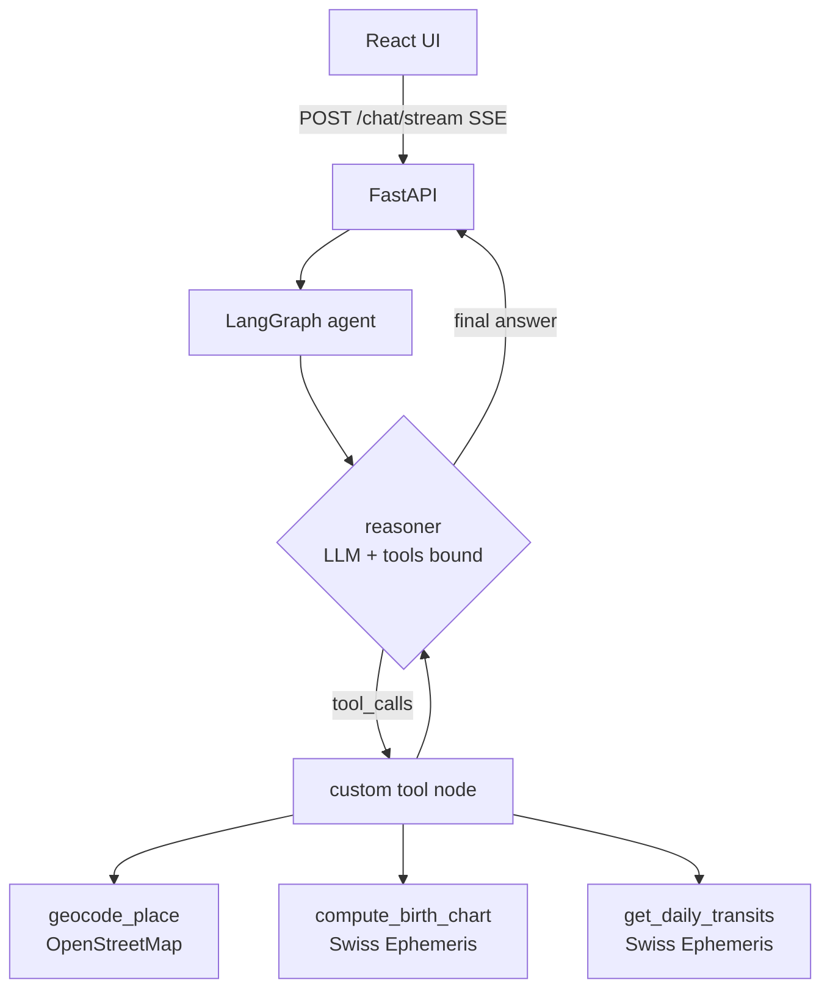

# AstroAgent ✦

An agentic AI astrologer for **Aradhana** — a chat companion that computes real
birth charts from a Swiss Ephemeris, reasons over live planetary data with
tools, and answers with warmth. Built with **LangGraph + FastAPI + React**.

## Quick start

Prerequisites: Python 3.11+, Node 18+, a free [Groq](https://console.groq.com) API key.

```bash
# 1. configure
cp .env.example .env          # then put your GROQ_API_KEY inside

# 2. backend
cd backend
python -m venv .venv
.venv\Scripts\activate        # Windows  (source .venv/bin/activate on mac/linux)
pip install -r requirements.txt
python main.py                # -> http://127.0.0.1:8000

# 3. frontend (second terminal)
cd frontend
npm install
npm run dev                   # -> http://localhost:5173

# 4. evaluation (from repo root)
python evals/run_evals.py     # full suite; --no-judge for deterministic only
```

## Architecture



The graph is a classic reason–act loop: `START → reasoner → (tools ⇄ reasoner) → END`.
A conditional edge (`tools_condition`) routes to the tool node whenever the LLM
emits tool calls; a `recursion_limit` of 12 is the hard step budget.

**State** (`backend/app/state.py`): conversation messages (with the
`add_messages` reducer), the user's birth details, and a cached chart.

### Design decisions worth knowing

- **Custom tool node, not the prebuilt one** (`backend/app/graph.py`): the
  user's saved birth date/time *override* whatever the model writes in tool
  args (an eval-caught bug: the model once passed `time=null` and the whole
  session believed the birth time was unknown). It also caches the chart per
  session (stretch goal: caching) and injects natal longitudes into transit
  calls automatically.
- **Tools never raise.** Every tool returns `{ok: false, error, message}` on
  bad input, so failures become conversation ("that date doesn't exist —
  could you check it?") instead of stack traces.
- **Deterministic pre-validation.** Impossible birth dates are caught in code
  before the model reasons, so it doesn't burn tool calls on bad data
  (eval finding GS-007).
- **Rate-limit-aware retries.** On 429 the reasoner honors the server's
  suggested wait (capped 30s) before falling back to an in-character apology.
- **Streaming.** `/chat/stream` emits SSE events: `token` (text), `tool_call`
  / `tool_result` (live activity shown in the UI), `done` / `error`.

## Stack

| Layer | Choice | Why |
|---|---|---|
| Agent | LangGraph | required; graph model fits the reason-act loop |
| LLM | `openai/gpt-oss-120b` via Groq | free tier, strong tool calling |
| Ephemeris | pyswisseph (Moshier) | real chart math, no data files needed |
| Geocoding | OpenStreetMap Nominatim | free, no key |
| API | FastAPI + SSE | small, typed, easy streaming |
| UI | React 18 + Vite, plain CSS | no UI libs; night-sky theme, animations |
| Evals | custom harness | see `evals/` and EVALUATION.md |

## Evaluation

Golden set: 26 versioned cases in `evals/golden_set.jsonl` (written before the
features). One command runs everything and appends to `evals/results.csv`.
Latest scorecard: **26/26 deterministic, judge 4.81/5, 0% crashes** — full
numbers and honest caveats in [EVALUATION.md](EVALUATION.md).

## Known limitations

- **Latency.** p50 ≈ 28s on Groq's free tier (queuing dominates). A paid tier
  or smaller model would cut this substantially; chart caching already removes
  repeat computation.
- **Judge ≠ ground truth.** The LLM judge (independent model) is spot-checked
  by hand, but tone scores remain approximate.
- **`knowledge_lookup` (RAG) not implemented** — the brief requires 3 of 4
  tools; I chose the three that ground the chart math and cut scope honestly here.
- **In-memory sessions.** Conversations persist in the browser (localStorage)
  and graph state lives in a `MemorySaver` checkpointer — a server restart
  clears server-side session memory. A SQLite checkpointer is the natural next step.
- **Western tropical astrology only** (Placidus houses); no Vedic/sidereal mode.

## Repo map

```
backend/   FastAPI + LangGraph agent (app/graph.py is the heart)
frontend/  React chat UI (src/components/, night-sky theme)
evals/     golden_set.jsonl, run_evals.py, results.csv, runs/
```
