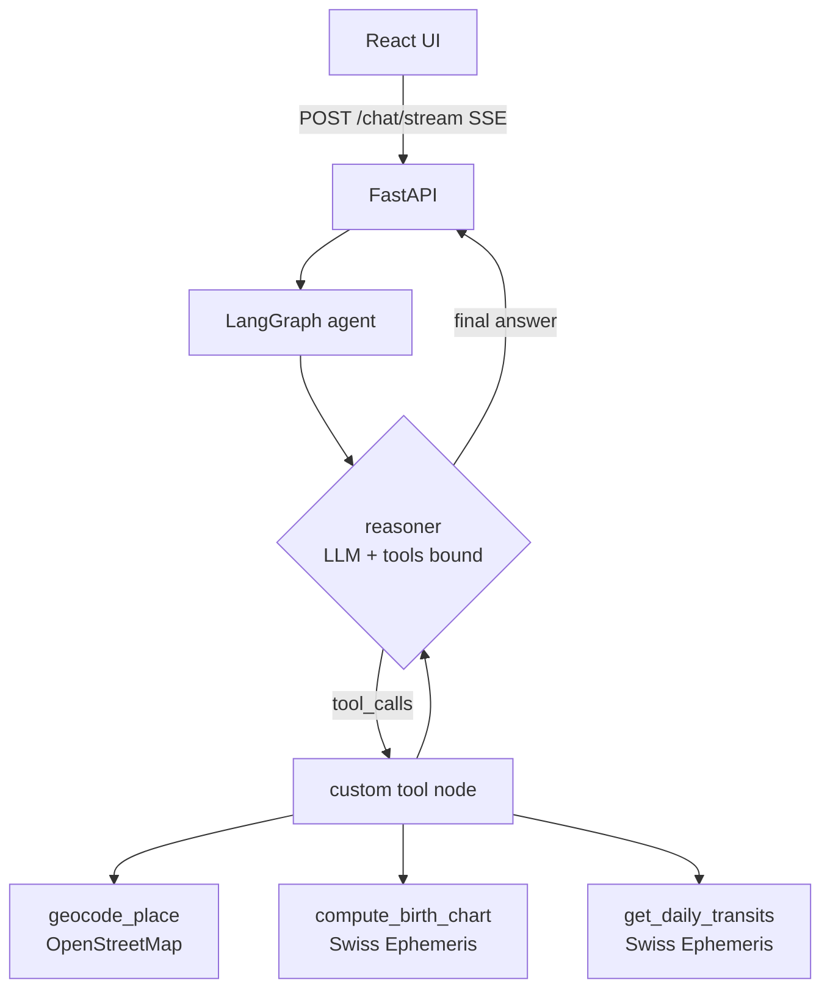

# AstroAgent ✦

An agentic AI astrologer for **Aradhana** — a chat companion that computes real
birth charts from a Swiss Ephemeris, reasons over live planetary data with
tools, and answers with warmth. Built with **LangGraph + FastAPI + React**.

<video src="https://github.com/user-attachments/assets/701514a6-b847-49e1-85ef-54107eeefe7f" controls width="900"></video>

## Quick start

Prerequisites: Python 3.11+, Node 18+, a free [Groq](https://console.groq.com) API key.

```bash
# 1. configure
cp .env.example .env          # then put your GROQ_API_KEY inside

# 2. backend
cd backend
python -m venv .venv
.venv\Scripts\activate        # Windows  (source .venv/bin/activate on mac/linux)
pip install -r requirements.txt
python main.py                # -> http://127.0.0.1:8000

# 3. frontend (second terminal)
cd frontend
npm install
npm run dev                   # -> http://localhost:5173

# 4. evaluation (from repo root)
python evals/run_evals.py     # full suite; --no-judge for deterministic only
```

## Architecture



The graph is a classic reason–act loop: `START → reasoner → (tools ⇄ reasoner) → END`.
A conditional edge (`tools_condition`) routes to the tool node whenever the LLM
emits tool calls; a `recursion_limit` of 12 is the hard step budget.

**State** (`backend/app/state.py`): conversation messages (with the
`add_messages` reducer), the user's birth details, and a cached chart.

### Design decisions worth knowing

- **Custom tool node, not the prebuilt one** (`backend/app/graph.py`): the
  user's saved birth date/time *override* whatever the model writes in tool
  args (an eval-caught bug: the model once passed `time=null` and the whole
  session believed the birth time was unknown). It also caches the chart per
  session (stretch goal: caching) and injects natal longitudes into transit
  calls automatically.
- **Tools never raise.** Every tool returns `{ok: false, error, message}` on
  bad input, so failures become conversation ("that date doesn't exist —
  could you check it?") instead of stack traces.
- **Deterministic pre-validation.** Impossible birth dates are caught in code
  before the model reasons, so it doesn't burn tool calls on bad data
  (eval finding GS-007).
- **Rate-limit-aware retries.** On 429 the reasoner honors the server's
  suggested wait (capped 30s) before falling back to an in-character apology.
- **Streaming.** `/chat/stream` emits SSE events: `token` (text), `tool_call`
  / `tool_result` (live activity shown in the UI), `done` / `error`.
- **No separate router node — a deliberate cut.** The brief's suggested path
  mentions an intent-classifier node. With only three tools, the reasoner's
  tool choice IS the intent classification; an explicit router would add one
  full LLM call of latency and a new failure point without changing behavior.
  The golden set records `expected.intent` per case, so if the tool count
  grows and a router becomes worthwhile, the eval labels to assert it against
  already exist.

## Stack

| Layer | Choice | Why |
|---|---|---|
| Agent | LangGraph | required; graph model fits the reason-act loop |
| LLM | `openai/gpt-oss-120b` via Groq | free tier, strong tool calling |
| Ephemeris | pyswisseph (Moshier) | real chart math, no data files needed |
| Geocoding | OpenStreetMap Nominatim | free, no key |
| API | FastAPI + SSE | small, typed, easy streaming |
| UI | React 18 + Vite, plain CSS | no UI libs; night-sky theme, animations |
| Evals | custom harness | see `evals/` and EVALUATION.md |

## Evaluation

Golden set: 28 versioned cases in `evals/golden_set.jsonl` (v1 written before
the features; v2 added multi-turn regression guards). One command runs
everything and appends to `evals/results.csv`. Latest scorecard: **100%
deterministic (27/27 scored), judge 4.81/5, 0% crashes** — full numbers,
the infra-vs-agent failure distinction, and honest caveats in
[EVALUATION.md](EVALUATION.md).

## Stretch goals attempted

- ✦ **Caching** — done: charts are computed once per session and cache-invalidated
  when birth details change (see custom tool node).
- ✦ **Memory across sessions** — partial: birth details and conversation history
  persist in the browser and are re-sent with every request, so a returning
  user is never re-asked; server-side graph memory is per-process (MemorySaver).
- ✦ Second agent and human-in-the-loop — not attempted; core + eval took priority,
  as the brief advises.

## Security posture (take-home scope)

What's protected today: the API key lives only in a server-side `.env` (never
shipped to the browser, never committed); all input is Pydantic-validated with
length caps; CORS is restricted to the local dev origins; the model's output
is rendered through react-markdown (HTML is escaped, no XSS via replies);
prompt-injection attempts - including via form fields - are part of the
tested golden set; and `session_id` is a client-generated UUIDv4, i.e. a
122-bit-random capability token that is not practically guessable.

What production would need (deliberately out of scope for a take-home, listed
so the gap is a decision rather than an oversight): real user identity (OAuth
or signed session tokens) so a session can't be shared by copying an ID,
per-user rate limiting on the API, HTTPS termination, durable server-side
session storage with per-user isolation, and secret management beyond a
`.env` file.

## Known limitations

- **Latency.** p50 ≈ 28s on Groq's free tier (queuing dominates). A paid tier
  or smaller model would cut this substantially; chart caching already removes
  repeat computation.
- **Judge ≠ ground truth.** The LLM judge (independent model) is spot-checked
  by hand, but tone scores remain approximate.
- **`knowledge_lookup` (RAG) not implemented** — the brief requires 3 of 4
  tools; I chose the three that ground the chart math and cut scope honestly here.
- **In-memory sessions.** Conversations persist in the browser (localStorage)
  and graph state lives in a `MemorySaver` checkpointer — after a server
  restart the UI still shows the old conversation but the agent no longer
  remembers it (birth details and chart recover automatically since the client
  re-sends them; conversational references don't). A SQLite checkpointer is
  the natural fix. Related small caveats: two tabs sharing one session can
  overwrite each other's saved history, and abandoned session threads live in
  server memory until restart.
- **Western tropical astrology only** (Placidus houses); no Vedic/sidereal mode.

## Repo map

```
backend/   FastAPI + LangGraph agent (app/graph.py is the heart)
frontend/  React chat UI (src/components/, night-sky theme)
evals/     golden_set.jsonl, run_evals.py, results.csv, runs/
```
